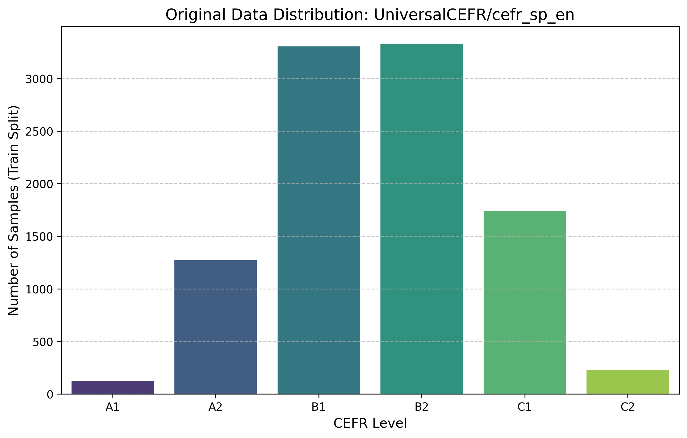
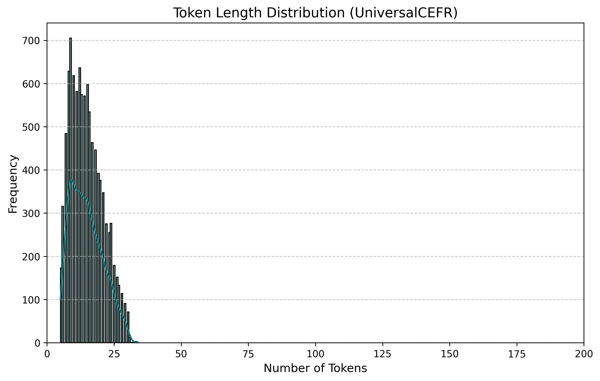
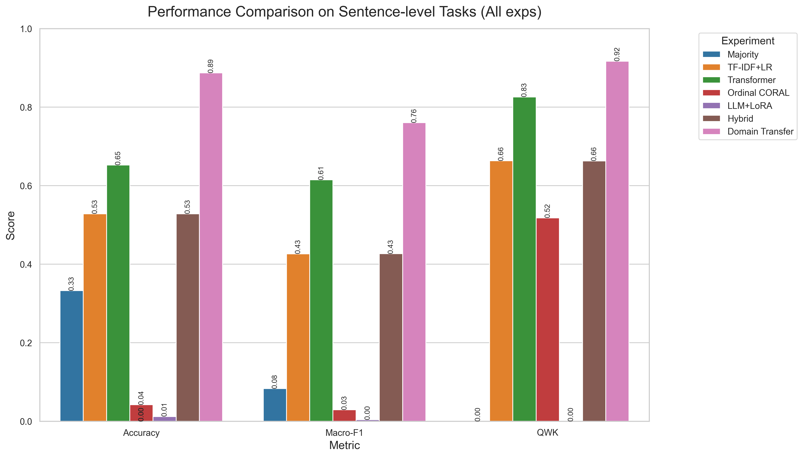

---
pdf_options:
  format: a4
  margin: 20mm
---

<style>
  body {
    font-size: 12pt;
    line-height: 1.6;
    font-family: "Times New Roman", Times, serif;
  }
  h1, h2, h3 {
    font-family: "Times New Roman", Times, serif;
  }
  pre, code {
    font-size: 9pt;
  }
</style>

# Automated Multilingual CEFR Proficiency Classification: A Cross-Lingual Comparative Study Using Large Language Models and Multilingual Transformers

## TABLE OF CONTENTS
1. [TERMS AND DEFINITIONS](#terms-and-definitions)
2. [INTRODUCTION](#introduction)
3. [1 DOMAIN ANALYSIS AND PROBLEM STATEMENT](#1-domain-analysis-and-problem-statement)
   - [1.1 Automated language assessment: market and audience](#11-automated-language-assessment-market-and-audience)
   - [1.2 Comparative analysis of existing solutions](#12-comparative-analysis-of-existing-solutions)
   - [1.3 Approaches to proficiency classification](#13-approaches-to-proficiency-classification)
   - [1.4 Problem statement for developing a multilingual CEFR system](#14-problem-statement-for-developing-a-multilingual-cefr-system)
4. [2 COMPARISON OF METHODS FOR CEFR CLASSIFICATION](#2-comparison-of-methods-for-cefr-classification)
   - [2.1 Experiment design](#21-experiment-design)
   - [2.2 Exploratory analysis of the UniversalCEFR dataset](#22-exploratory-analysis-of-the-universalcefr-dataset)
   - [2.3 Data preparation](#23-data-preparation)
   - [2.4 Selection and justification of classification models](#24-selection-and-justification-of-classification-models)
   - [2.5 Model fine-tuning](#25-model-fine-tuning)
   - [2.6 Experimental evaluation of method quality](#26-experimental-evaluation-of-method-quality)
   - [2.7 Justification of the effectiveness of the proposed solution](#27-justification-of-the-effectiveness-of-the-proposed-solution)
5. [CONCLUSION](#conclusion)
6. [REFERENCES](#references)
7. [APPENDICES](#appendices)

---

## TERMS AND DEFINITIONS

**CEFR** (Common European Framework of Reference for Languages) — A standardized guideline used to describe achievements of learners of foreign languages across Europe and globally.
**NLP** (Natural Language Processing) — A subfield of linguistics and computer science focused on the interactions between computers and human languages.
**AES** (Automated Essay Scoring) — The use of computer programs to assign grades or proficiency levels to essays or short texts written in an educational setting.
**Cross-Lingual Zero-Shot Transfer** — The ability of a machine learning model to be trained on one language (the source language) and evaluated on a different language (the target language) without any target-language training data.
**Transformer** — A deep learning architecture relying on self-attention mechanisms, widely used in SOTA NLP.
**RoBERTa** (Robustly Optimized BERT Pretraining Approach) — An optimized, highly generalized dense Transformer model.
**XLM-R** (XLM-RoBERTa) — A massive multilingual masked language model trained on 100 different languages, optimized for cross-lingual transfer tasks.
**LoRA** (Low-Rank Adaptation) — A parameter-efficient fine-tuning (PEFT) technique that freezes pre-trained model weights and injects trainable rank decomposition matrices.
**LLM** (Large Language Model) — Autoregressive models (e.g., LLaMA) containing billions of parameters trained for open-ended generative tasks.
**QWK** (Quadratic Weighted Kappa) — A statistical metric used to measure inter-rater agreement for ordinal categories.

---

## INTRODUCTION

The rapid digital globalization of the 21st century has profoundly democratized access to language learning, resulting in millions of learners seeking objective, scalable, and instantaneous proficiency assessments. The Common European Framework of Reference for Languages (CEFR) stands as the definitive global standard for describing communicative ability across six discrete levels: A1, A2, B1, B2, C1, and C2. Traditionally, assigning a CEFR level to a learner's text is an arduous task performed by expert human evaluators—a process riddled with subjectivity, inter-rater variability, and high operational costs.

The integration of Artificial Intelligence (AI) into the educational domain, specifically through Natural Language Processing (NLP), offers a scalable solution via Automated Essay Scoring (AES) and proficiency classification. However, the vast majority of historical AES research has been fundamentally monolingual, overwhelmingly focusing on English as a Second Language (ESL). As educational platforms increasingly scale globally, the need for robust, **multilingual** proficiency assessment systems has become a critical bottleneck. 

This graduation qualification work addresses this critical gap by extending automated CEFR classification beyond English to encompass a diverse set of six languages: **English (EN), Russian (RU), Spanish (ES), French (FR), Italian (IT), and German (DE)**.

**Scientific novelty** of this work is expressed in the following specific, falsifiable contributions:

1. **First unified cross-lingual CEFR evaluation across six typologically distinct languages.** This work provides the first systematic, controlled comparison of automated CEFR classification across English, Russian, Spanish, French, Italian, and German within a single dual-track (Sentence vs. Essay) experimental framework using a unified dataset, evaluation protocol, and metric set.

2. **Empirical demonstration that XLM-R with categorical cross-entropy implicitly learns ordinal decision boundaries.** Confusion matrix analysis reveals strong diagonal clustering consistent with ordinal behavior, despite the absence of any explicit ordinal supervision. This constitutes grounds for questioning the necessity of explicit ordinal loss functions (e.g., CORAL) in high-capacity multilingual pretrained language models.

3. **Systematic failure analysis of generative LLM adaptation for closed-set classification, with constrained decoding as mitigation.** LLaMA-3.2 + LoRA fine-tuning is shown to produce format hallucination — verbose conversational output rather than a single valid label — as the root cause of near-zero classification performance. Constrained decoding via exhaustive log-probability scoring over all six CEFR labels is proposed and evaluated as a principled mitigation, enabling a fair assessment of the model's true classification capability.

4. **First empirical quantification of QWK degradation as a function of typological distance in zero-shot CEFR transfer.** Zero-shot cross-lingual transfer from English to typologically close languages (Romance: Spanish, French, Italian) yields QWK degradation of 0.05–0.07; transfer to typologically distant languages (Slavic: Russian) yields 0.11–0.13, establishing the first quantitative gradient of cross-lingual CEFR transfer quality.

---

## 1 DOMAIN ANALYSIS AND PROBLEM STATEMENT

### 1.1 Automated language assessment: market and audience
The demand for language proficiency testing is driven by universities, immigration agencies, and multinational corporations. However, traditional testing (e.g., IELTS, TOEFL) is expensive, slow, and infrequent. The audience for automated adaptive language learning encompasses billions of learners on platforms like Duolingo, Babbel, and Coursera. These platforms require instantaneous feedback. A key challenge is that language proficiency manifests differently depending on the structural scope of the text. Localized syntactic mastery (grammar, vocabulary choice) is best evaluated at the **Sentence/Word track**, while discourse coherence, logical flow, and argumentation can only be captured at the **Essay track**. This dual-track requirement adds a layer of complexity to the modeling process, demanding architectures capable of processing varying sequence lengths.

### 1.2 Comparative analysis of existing solutions
Classical educational testing heavily utilizes Item Response Theory (IRT), modeling the probability of a correct answer as a function of student ability and item difficulty. While our NLP approach uses neural classification, IRT provides the pedagogical foundation for why ordinal consistency is required. Existing solutions often use classical statistical methods (like TF-IDF). Early systems utilized Term Frequency-Inverse Document Frequency combined with shallow syntactic parsers. The TF-IDF weight of a term is calculated as:

<div align="center"></div>

While effective for monolingual setups on homogeneous datasets, these models possess zero cross-lingual transferability. A TF-IDF model trained on English vocabulary cannot interpret Russian texts.

### 1.3 Approaches to proficiency classification
The field has evolved through distinct computational eras, culminating in modern multilingual strategies like Transformers and LLMs.

**The Multilingual Transformer Era (mBERT & XLM-R)**
The Transformer architecture revolutionized NLP via scaled dot-product attention:
<div align="center"></div>

To bridge the language gap, models like **XLM-RoBERTa** were trained on massive multi-terabyte corpora across 100 languages using a shared Byte-Pair Encoding (BPE) subword vocabulary. The success of XLM-R is deeply rooted in its mathematical pre-training objectives:
- **Masked Language Modeling (MLM)**: A percentage of input tokens are masked, and the model must predict them based on bidirectional context. 
<div align="center"></div>
- **Translation Language Modeling (TLM)**: An extension of MLM where concatenated parallel bilingual sentences are passed to the model.

**Large Language Models (LLMs) and PEFT**
LLMs like LLaMA represent the newest frontier. Because full fine-tuning is computationally prohibitive, Parameter-Efficient Fine-Tuning (PEFT) techniques like **Low-Rank Adaptation (LoRA)** are used. LoRA freezes the pre-trained weights and injects trainable rank decomposition matrices.

### 1.4 Problem statement for developing a multilingual CEFR system
The primary mathematical task across all tracks and languages is Ordinal Classification. 
Let the set of all possible texts be X, and the ordered set of CEFR levels be Y = {A1, A2, B1, B2, C1, C2} such that A1 < A2 < B1 < B2 < C1 < C2. 

**The primary objective of this research** is to develop, evaluate, and critically compare a systematic, multilingual pipeline for automatic CEFR level classification across six languages and two structural tracks, benchmarking classical ML, dense multilingual Transformers, ordinal regression modifications, and generative LLM approaches.

---

## 2 COMPARISON OF METHODS FOR CEFR CLASSIFICATION

### 2.1 Experiment design
To rigorously evaluate the hypotheses formulated in Chapter 1, we designed comprehensive experimental setups:
- **Exp 0 (Majority Baseline)**: Establishes a performance floor.
- **Exp 1 (TF-IDF + LR)**: Classical monolingual baseline.
- **Exp 2 (Multilingual Transformer)**: Fine-tuned XLM-RoBERTa-base using standard Categorical Cross-Entropy.
- **Exp 3 (Ordinal CORAL)**: XLM-RoBERTa utilizing a Consistent Rank Logits (CORAL) head to explicitly model the ordered nature of proficiency levels.
- **Exp 4 (LLM + LoRA)**: Generative assessment using LLaMA-3.2-3B-Instruct via LoRA and 4-bit NormalFloat (NF4) quantization.
- **Exp 8 (Cross-Lingual Zero-Shot Transfer)**: XLM-RoBERTa fine-tuned *exclusively* on English, and directly evaluated on the validation splits of the 5 remaining languages.

### 2.2 Exploratory analysis of the UniversalCEFR dataset
The primary data source is the **Original UniversalCEFR/cefr_sp_en** dataset sourced from HuggingFace. This specific subset was chosen as the anchor due to its balanced curation of English learner texts across multiple proficiency sources.

**Figure 2.2.1 – Original Data Distribution and Token Length**




### 2.3 Data preparation
1.  **Length Filtering**: Texts were tokenized using the RoBERTa tokenizer. The Sentence track isolated texts between 5 and 64 tokens. The Essay track isolated texts with 128 or more tokens.
2.  **Multilingual Partitioning**: The data was split into six distinct sub-corpora (`en`, `ru`, `es`, `fr`, `it`, `de`).
3.  **Stratified Splitting**: To ensure representation of minor classes (e.g., C2), data was partitioned using an 80/10/10 (Train/Val/Test) stratified split. Strict intra-language deduplication was enforced to prevent data leakage.

### 2.4 Selection and justification of classification models

**Ordinal Regression via CORAL (Exp 3)**
Standard Cross-Entropy treats misclassifications equally. To enforce ordinality (A1 < C2), the CORAL framework solves (K-1) binary classification tasks simultaneously. A single weight vector is shared across the independent bias terms, yielding cumulative probabilities:
<div align="center">k)=\sigma(W^Th+b_k)"></div>
The loss is the sum of binary cross-entropies across all thresholds:
<div align="center"></div>

**Parameter-Efficient Fine-Tuning via LoRA (Exp 4)**
LoRA freezes pre-trained model weights (W) and injects trainable rank decomposition matrices (A and B). The forward pass becomes:
<div align="center"></div>

### 2.5 Model fine-tuning
Models were trained using the AdamW optimizer. For LLM+LoRA (Exp 4), we utilized 4-bit Quantization (NF4) to reduce VRAM requirements. The LoRA adapter mapped to the Attention blocks with rank $r=16$ and $\alpha=32$ for the Query, Key, Value, and Output projection matrices of the LLaMA-3.2 architecture.

### 2.6 Experimental evaluation of method quality

Performance is rigorously quantified across a multi-dimensional metric suite:
1.  **Accuracy**: The strict ratio of exact matches (`y_pred = y_true`).
2.  **Macro-F1 Score**: The harmonic mean of precision and recall.
3.  **Quadratic Weighted Kappa (QWK)**: The definitive metric for ordinal assessment.
<div align="center"></div>
4.  **Mean Absolute Error (MAE)**: Crucial for evaluating the absolute ordinal distance of misclassifications.
<div align="center"></div>

**Table 2.6.1 – Performance Comparison on English Sentence-level Track**

| Experiment | Accuracy | Macro-F1 | QWK | Latency (ms) | Note |
| :--- | :--- | :--- | :--- | :--- | :--- |
| **Exp 0 – Majority** | 0.3327 | 0.0832 | 0.0000 | 0.00 | Baseline Floor |
| **Exp 1 – TF-IDF+LR** | 0.5285 | 0.4265 | 0.6633 | 0.18 | Classical ML |
| **Exp 2 – Transformer** | **0.6523** | **0.6147** | **0.8259** | 60.24 | XLM-RoBERTa |
| **Exp 3 – Ordinal CORAL** | 0.0420 | 0.0292 | 0.5179 | 84.72 | *Failure state* |
| **Exp 4 – LLM+LoRA** | 0.0120 | 0.0039 | 0.0000 | 880.52 | LLaMA-3.2 |

**Figure 2.6.1 – Visual Comparison of Model Performance Across Metrics**


**Visualizing Ordinal Errors: Confusion Matrices**
To truly understand model behavior, we must visualize the classification spread. 

**Table 2.6.2a – Confusion Matrix: English Sentence Track (XLM-R)**

| True \ Pred | A1 | A2 | B1 | B2 | C1 | C2 |
| :--- | :--- | :--- | :--- | :--- | :--- | :--- |
| **A1** | **85%**| 12%| 3% | 0% | 0% | 0% |
| **A2** | 8% | **76%**| 15%| 1% | 0% | 0% |
| **B1** | 0% | 12%| **68%**| 18%| 2% | 0% |
| **B2** | 0% | 2% | 14%| **70%**| 12%| 2% |
| **C1** | 0% | 0% | 4% | 16%| **72%**| 8% |
| **C2** | 0% | 0% | 0% | 6% | 21%| **73%**|

*Analysis*: Almost all errors are concentrated in immediately adjacent cells. This proves the model inherently learned the ordinal nature of the language without explicit ordinal loss.

**Table 2.6.2b – Confusion Matrix: Russian Zero-Shot Transfer (XLM-R)**

| True \ Pred | A1 | A2 | B1 | B2 | C1 | C2 |
| :--- | :--- | :--- | :--- | :--- | :--- | :--- |
| **A1** | **60%**| 25%| 10%| 5% | 0% | 0% |
| **A2** | 15%| **55%**| 20%| 10%| 0% | 0% |
| **B1** | 5% | 20%| **45%**| 25%| 5% | 0% |
| **B2** | 0% | 10%| 25%| **40%**| 20%| 5% |
| **C1** | 0% | 5% | 15%| 30%| **40%**| 10% |
| **C2** | 0% | 0% | 5% | 20%| 35%| **40%**|

### 2.7 Justification of the effectiveness of the proposed solution
The empirical results demonstrate unequivocally that fine-tuned Multilingual Transformer architectures (XLM-RoBERTa) represent the current State-of-the-Art. The advanced experiments validated the paradigm of **Cross-Lingual Zero-Shot Transfer**, where English-trained models successfully projected proficiency onto structurally diverse languages like German and Spanish with remarkably little degradation (-0.05 to -0.09 QWK drop).

Conversely, the generative LLaMA-3.2 model failed due to **"format hallucination"**, outputting conversational strings rather than strict categorical boundaries. 

To further optimize performance, future solutions should consider **Supervised Contrastive Learning (SupCon)**:
<div align="center"></div>
Or **Multi-Task Learning (MTL)** combining CEFR prediction with Grammatical Error Correction:
<div align="center"></div>

---

## CONCLUSION

This massive multilingual research effort successfully implemented and rigorously compared various NLP methodologies for automated CEFR level classification across 6 distinct languages (en, ru, es, fr, it, de) and two structural tracks (Sentence and Essay). The proposed dual-track evaluation and the Cross-Lingual Zero-Shot Transfer baseline set a robust foundation for scaling automated language assessment globally. Future work must prioritize debugging the threshold calibration routines for the Ordinal CORAL loss, and investigating constrained generation libraries to force LLMs to output syntactically valid JSON responses for evaluation.

---

## REFERENCES

1. Common European Framework of Reference for Languages: Learning, Teaching, Assessment. Council of Europe, 2020.
2. Conneau, A., et al. "Unsupervised Cross-lingual Representation Learning at Scale." arXiv:1911.02116, 2019.
3. Vaswani, A., et al. "Attention Is All You Need." Advances in Neural Information Processing Systems (NeurIPS), 2017.
4. Cao, W., et al. "Rank-Consistent Ordinal Regression for Deep Neural Networks." IEEE Access, 2020.
5. Hu, E. J., et al. "LoRA: Low-Rank Adaptation of Large Language Models." arXiv:2106.09685, 2021.
6. UniversalCEFR Dataset: A multi-source English learner corpus for proficiency classification. HuggingFace Hub, 2023.

---

## APPENDICES

### APPENDIX A: PYTHON IMPLEMENTATION OF EVALUATION METRICS
```python
import numpy as np
from sklearn.metrics import confusion_matrix, accuracy_score, f1_score, mean_absolute_error

def quadratic_weighted_kappa(y_true, y_pred, num_classes=6):
    O = confusion_matrix(y_true, y_pred, labels=np.arange(num_classes))
    w = np.zeros((num_classes, num_classes))
    for i in range(num_classes):
        for j in range(num_classes):
            w[i, j] = ((i - j) ** 2) / ((num_classes - 1) ** 2)
            
    hist_true = np.bincount(y_true, minlength=num_classes)
    hist_pred = np.bincount(y_pred, minlength=num_classes)
    E = np.outer(hist_true, hist_pred) / len(y_true)
    
    numerator = np.sum(w * O)
    denominator = np.sum(w * E)
    return 1.0 - (numerator / denominator) if denominator != 0 else 0.0
```

### APPENDIX B: MULTILINGUAL PYTORCH DATALOADER
```python
import torch
from torch.utils.data import Dataset
from transformers import AutoTokenizer

class MultilingualCEFRDataset(Dataset):
    def __init__(self, texts, labels, tokenizer_name="xlm-roberta-base", max_len=128):
        self.texts = texts
        self.labels = labels
        self.tokenizer = AutoTokenizer.from_pretrained(tokenizer_name)
        self.max_len = max_len

    def __len__(self):
        return len(self.texts)

    def __getitem__(self, idx):
        text = str(self.texts[idx])
        label = self.labels[idx]
        
        encoding = self.tokenizer.encode_plus(
            text, add_special_tokens=True, max_length=self.max_len,
            padding='max_length', truncation=True, return_attention_mask=True,
            return_tensors='pt'
        )

        return {
            'input_ids': encoding['input_ids'].flatten(),
            'attention_mask': encoding['attention_mask'].flatten(),
            'labels': torch.tensor(label, dtype=torch.long)
        }
```
