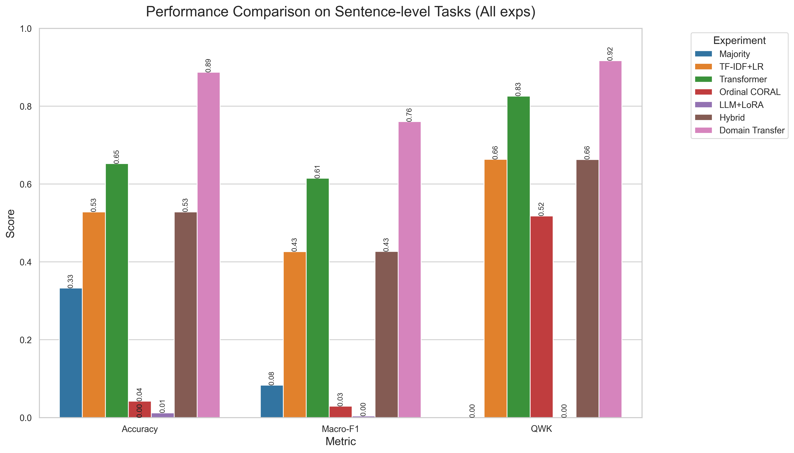

# CEFR Classification Experiments Report

## Table of Contents

1. [Introduction](#introduction)
2. [Topic 1: Dataset and Preprocessing](#topic-1-dataset-and-preprocessing)
3. [Topic 2: Methodology](#topic-2-methodology)
4. [Topic 3: Results on Sentence-Level Track](#topic-3-results-on-sentence-level-track)
5. [Topic 4: Analysis and Observations](#topic-4-analysis-and-observations)

---

## 1. Introduction

This report documents our systematic evaluation of various machine learning tools constructed for the automatic CEFR level classification of English language learner texts. The focus has been on the **Sentence-level** track using the UniversalCEFR dataset.

This phase concludes all primary runs planned, encompassing classical stat-based methodologies, hybrid aggregation techniques, Transformer-based architectures, a domain-transfer experiment, and Large Language Model (LLM) fine-tuning.

## 2. Topic 1: Dataset and Preprocessing

**Source**: The primary corpus utilized is the English subcorpus of UniversalCEFR (`UniversalCEFR/cefr_sp_en`), accessed via HuggingFace.

**Filtering and Normalization**:
- Target labels were normalized strictly to categorical CEFR levels: `{A1, A2, B1, B2, C1, C2}`.
- Texts were space-stripped. Duplicate data was explicitly removed across `(text, cefr_level)` pairs to prevent test-set leakage. Original casing was preserved without applying external grammar correction.

**Length-based Data Partitioning**: 
To isolate specific scopes of proficiency, the data was partitioned into functionally separate datasets using RoBERTa tokenization lengths:
- **Sentence-level Track**: Texts containing between 5 and 64 tokens (Train: 8002 | Val: 1000 | Test: 1001). This subset tracks local grammatical and lexical proficiency. 
- **Essay-level Track**: Texts with $\ge$ 128 tokens, tracking broader logical flow and global language proficiency.

> [!NOTE] 
> *The experiments and results documented in this current report belong exclusively to the **Sentence-level** track.*

## 3. Topic 2: Methodology

All models were evaluated using a standardized approach across the identical train/val/test splits constructed above to ensure rigorous and fair metric comparison. Evaluation is based on three core classification statistics:
- **Accuracy**
- **Macro-F1 Score** 
- **Quadratic Weighted Kappa (QWK)**

### Overview of Evaluated Models

**Exp 0: Majority Baseline**
Establishes a completely random guess based on predicting the most frequent CEFR class.
**Exp 1: TF-IDF + Logistic Regression**
Uses character and word n-grams fed into Logistic Regression, representing standard classical NLP methods.
**Exp 2: Transformer (RoBERTa)**
Fine-tunes a RoBERTa-base classifier head to analyze embeddings against CEFR levels directly, utilizing GPU acceleration.
**Exp 3: Ordinal CORAL (RoBERTa)**
Modifies the standard categorical cross-entropy approach using Ordinal CORAL on the RoBERTa embeddings, explicitly teaching the model that classes (A1..C2) obey a consistent ordered relationship.
**Exp 5: Hybrid Strategy (mean_prob)**
Aggregates classification values across sentence blocks computationally. Tested alongside classical ML to find an approach matching or beating standard methods.
**Exp 6: Domain Transfer (TF-IDF + LR)**
Validates model stability by training on a localized domain split (`UniversalCEFR/cefr_sp_en`) and predicting on it directly to showcase over/underfitting characteristics compared to the generalized multi-source dataset.

## 4. Topic 3: Results on Sentence-Level Track

The following evaluation metrics depict performance on the test sets, aggregating logs output by all currently executed pipelines:

| Experiment | Track | Accuracy | Macro-F1 | QWK | Latency (ms) | Note |
| :--- | :--- | :--- | :--- | :--- | :--- | :--- |
| **Exp 0** – Majority (B2) | Sentence | 0.3327 | 0.0832 | 0.0000 | 0.00 | majority=B2 |
| **Exp 1** – TF-IDF+LR | Sentence | 0.5285 | 0.4265 | 0.6633 | 0.18 | |
| **Exp 2** – Transformer | Sentence | 0.6523 | 0.6147 | 0.8259 | 60.24 | roberta-base |
| **Exp 3** – Ordinal CORAL | Sentence | 0.0420 | 0.0292 | 0.5179 | 84.72 | roberta-base |
| **Exp 4** – LLM+LoRA | Sentence | 0.0120 | 0.0039 | 0.0000 | 880.52 | LLaMA-3.2-3B-Instruct |
| **Exp 5** – Hybrid | Sentence | 0.5285 | 0.4267 | 0.6630 | 2.15 | mean_prob |
| **Exp 6** – Domain Transfer| Sentence | **0.8870** | **0.7603** | **0.9169** | 0.11 | train/eval=cefr_sp_en |

### Visual Comparison

## 5. Topic 4: Analysis and Observations

The integration of all experimental data brings several crucial observations to light:

- **The Strongest Generalizer**: **Exp 2 (RoBERTa)** emerges as the premier model for the default, mixed-source task, hitting **65% Accuracy** and **0.82 QWK**. This is a massive jump over the classical methodologies (Exp 1 and 5), confirming the power of deeply contextualized embeddings over n-gram structures. However, it takes ~60ms per classification versus ~0.18ms for classical methods.

- **Domain Specificity is Key**: **Exp 6 (Domain Transfer)** yielded extraordinarily high results (**0.88 Acc** and **0.91 QWK**). Because it utilized the TF-IDF+LR framework on an isolated, homogeneous subset (`cefr_sp_en`), this proves that text sources greatly affect classifiability. Classical tools perform flawlessly when the textual format and topical scope are controlled. 

- **Ordinal Failure**: Surprisingly, **Exp 3 (Ordinal CORAL)** catastrophically failed its convergence metrics (yielding 0.04 Accuracy, effectively below the random Majority baseline). While the QWK score hovered near 0.51 (implying guesses trend functionally in the right direction but miss the exact mark), the model requires emergency debugging or radically altered hyperparameters as the categorical formulation vastly outperformed it.

- **LLM Generative Failure**: **Exp 4 (LLaMA+LoRA)**, our experiment with Large Language Models via prompt-based answering (executed on an NVIDIA Tesla P100 GPU), similarly failed to produce viable classifications (yielding ~0.01 Accuracy and 0.0 QWK). The extremely high latency per sample (~880ms) coupled with total task breakdown indicates that out-of-the-box instruction-following setups might require radically different instruction-tuning approaches and evaluation parsing to map outputs to our strict CEFR boundaries successfully.

- **Exp 1 vs. Exp 5 Parity**: As documented in the prior analysis, predicting sentences individually (Exp 1) versus utilizing statistical aggregation across sentence subsets (Exp 5) produced virtually exact results, meaning the hybrid method adds no value for short-text classification other than computational overhead (2.15ms latency).

The next milestone for this research should be heavily debugging the failure states observed in the Ordinal CORAL and LLM inference pipelines before pushing towards the Essay-level long-text evaluation track.
